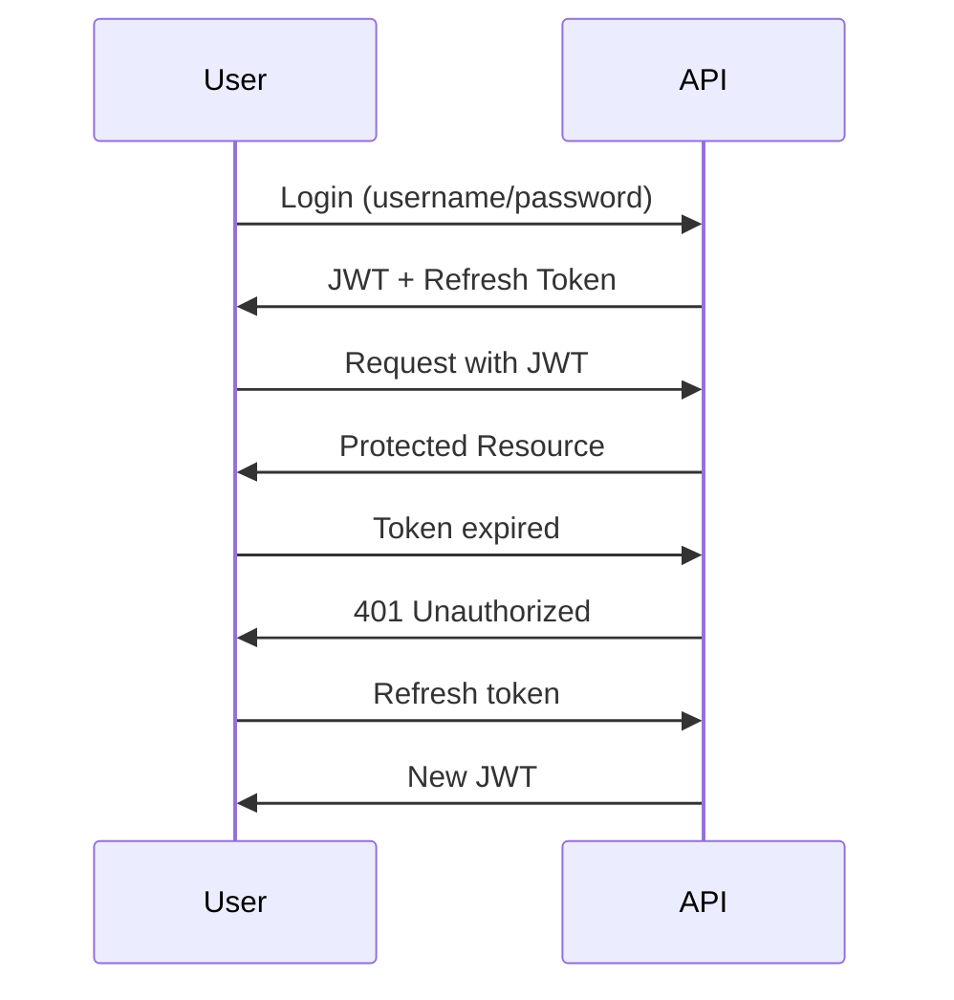

Here's a more comprehensive README.md file:

# User Management System API


[](LICENSE)

A secure RESTful API for user management with JWT authentication, role-based access control, and full CRUD operations.

## Table of Contents
- [Features](#features)
- [Tech Stack](#tech-stack)
- [Prerequisites](#prerequisites)
- [Installation](#installation)
- [Configuration](#configuration)
- [API Documentation](#api-documentation)
- [Endpoints](#endpoints)
- [Usage Examples](#usage-examples)
- [Security](#security)
- [Database Schema](#database-schema)
- [Troubleshooting](#troubleshooting)
- [License](#license)
- [Contributing](#contributing)

## Features 🚀

- **JWT Authentication**
  - Secure token-based authentication
  - Access token (15min) + Refresh token
- **Authorization**
  - Role-based access control (ADMIN/USER)
  - Protected endpoints with Spring Security
- **User Management**
  - User registration/login
  - Password reset via email
  - CRUD operations with access control
- **Security**
  - BCrypt password hashing
  - Rate limiting (100 requests/min)
  - CSRF protection
- **API Documentation**
  - Interactive Swagger UI

## Tech Stack 💻

- **Backend**
  - Java 21
  - Spring Boot 3.4.5
  - Spring Security
  - Spring Data JPA
- **Database**
  - MySQL 8.0+
- **Authentication**
  - JSON Web Tokens (JWT)
  - JJWT Library
- **Tools**
  - Maven 3.9+
  - Swagger/OpenAPI 3.0

## Prerequisites 📋

- Java Development Kit (JDK) 21
- MySQL Server 8.0+
- Maven 3.9+
- IDE (IntelliJ/Eclipse recommended)
- Postman/curl for API testing

## Project Structure 📂

```bash
user-management/
├── src/
│   ├── main/
│   │   ├── java/
│   │   │   └── com/example/usermanagement/
│   │   │       ├── config/       # Configuration classes
│   │   │       ├── controller/   # REST API controllers
│   │   │       ├── dto/          # Data Transfer Objects
│   │   │       ├── entity/       # JPA entities
│   │   │       ├── exception/    # Custom exceptions
│   │   │       ├── repository/   # Spring Data repositories
│   │   │       ├── security/     # Security configurations
│   │   │       ├── service/      # Business logic services
│   │   │       └── UsermanagementApplication.java # Main class
│   │   └── resources/
│   │       ├── application.properties # Configurations
│   │       └── data.sql          # Initial data setup
├── pom.xml                       # Maven dependencies
└── README.md                     # Project documentation
```

## Installation ⚙️

1. **Clone Repository**
```bash
git clone https://github.com/carlosddcmx/misc/user-management.git
cd user-management
```

2. **Create MySQL Database**
```sql
CREATE DATABASE user_management;
```

3. **Configure Application**
   Create `src/main/resources/application.properties` with:
```properties
spring.datasource.url=jdbc:mysql://localhost:3306/user_management
spring.datasource.username=your_username
spring.datasource.password=your_password
app.jwt.secret=your-256-bit-secret-key
```

4. **Build and Run**
```bash
mvn clean install
mvn spring-boot:run
```

The application will:
- Create database tables automatically
- Insert initial roles (ADMIN/USER)
- Create sample users (admin/password, user/password)

## Configuration ⚙️

| Property                          | Description                     | Default Value       |
|-----------------------------------|---------------------------------|---------------------|
| `spring.datasource.url`           | MySQL connection URL            | -                   |
| `spring.datasource.username`      | Database username               | -                   |
| `spring.datasource.password`      | Database password               | -                   |
| `app.jwt.secret`                  | JWT signing key                 | -                   |
| `app.jwt.expiration-ms`           | Access token expiration         | 900000 (15min)      |
| `app.jwt.refresh-expiration-ms`   | Refresh token expiration        | 604800000 (7 days)  |
| `app.rate-limit.requests-per-minute` | API request limit           | 100                 |

## API Documentation 📖

Access interactive documentation at:  
`http://localhost:8080/swagger-ui.html`


**To authenticate:**
1. Click "Authorize" button
2. Enter: `Bearer <your-jwt-token>`
3. Test secured endpoints directly in Swagger

## Endpoints 🌐

### Authentication
| Method | Endpoint                | Description          |
|--------|-------------------------|----------------------|
| POST   | /api/auth/register      | Register new user    |
| POST   | /api/auth/login         | User login           |
| POST   | /api/auth/refresh       | Refresh access token |
| POST   | /api/auth/logout        | Invalidate tokens    |

### User Management
| Method | Endpoint                | Access      |
|--------|-------------------------|-------------|
| GET    | /api/users              | ADMIN only  |
| GET    | /api/users/{id}         | Owner/ADMIN |
| GET    | /api/users/me           | Authenticated |
| PUT    | /api/users/{id}         | Owner       |
| DELETE | /api/users/{id}         | ADMIN only  |

## Usage Examples 💡

### 1. User Registration
```bash
curl -X POST 'http://localhost:8081/api/auth/register' \
  -H 'Content-Type: application/json' \
  -d '{
    "username": "new_user",
    "email": "user@example.com",
    "password": "SecurePass123!"
  }'
```

**Response:**
```json
{
  "accessToken": "eyJhbGciOi...",
  "refreshToken": "d8f7a9b0...",
  "tokenType": "Bearer"
}
```

### 2. Password Reset
```bash
# 1. Request reset token
curl -X POST 'http://localhost:8081/api/auth/reset-password/request?email=user@example.com'

# 2. Check console for token, then:
curl -X POST 'http://localhost:8081/api/auth/reset-password/reset' \
  -H 'Content-Type: application/json' \
  -d '{
    "token": "reset-token-from-email",
    "newPassword": "NewSecurePass456!"
  }'
```

### 3. Admin: Get All Users
```bash
curl -X GET 'http://localhost:8081/api/users' \
  -H 'Authorization: Bearer admin-access-token'
```

**Response:**
```json
[
  {
    "id": 1,
    "username": "admin",
    "email": "admin@example.com",
    "roles": ["ROLE_ADMIN"]
  },
  {
    "id": 2,
    "username": "user",
    "email": "user@example.com",
    "roles": ["ROLE_USER"]
  }
]
```

## Security 🔒

### Authentication Flow


## Database Schema 🗃️


**Tables:**
- `users`: User accounts
- `roles`: Available roles
- `users_roles`: User-role mapping

## Troubleshooting 🛠️

| Issue                          | Solution                      |
|--------------------------------|-------------------------------|
| Database connection failed     | Verify MySQL credentials      |
| JWT validation errors          | Check secret key consistency  |
| 403 Forbidden errors           | Verify user roles/token scope |
| 429 Too Many Requests          | Check rate limiting settings  |
| Email not sending              | Configure SMTP properties     |

## License 📄

This project is licensed under the MIT License - see the [LICENSE](LICENSE) file for details.

